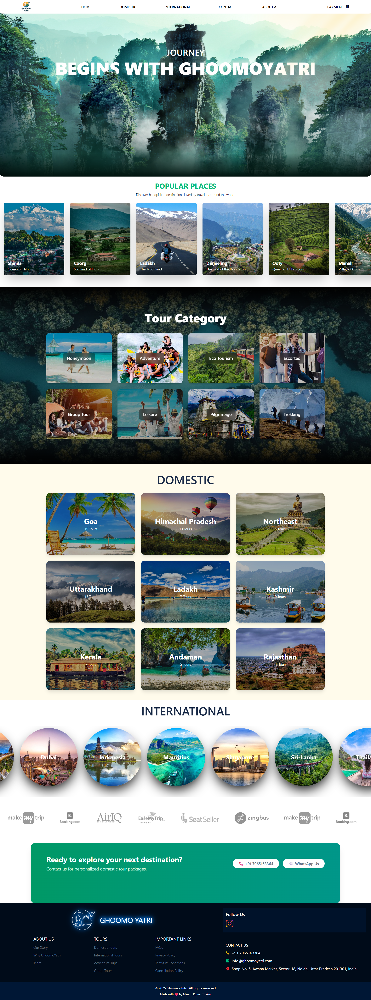
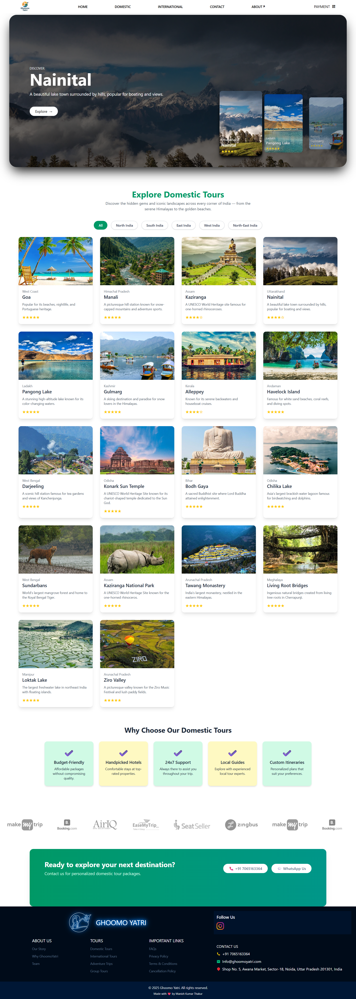
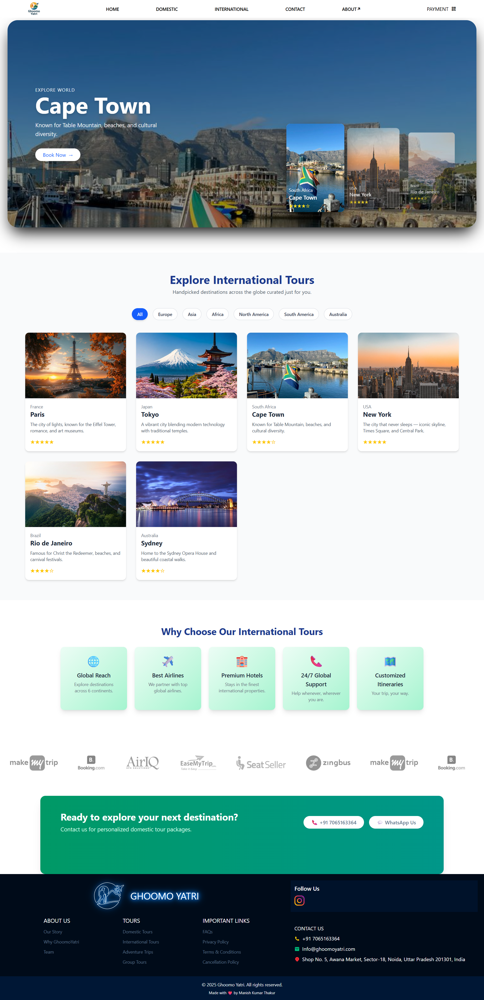
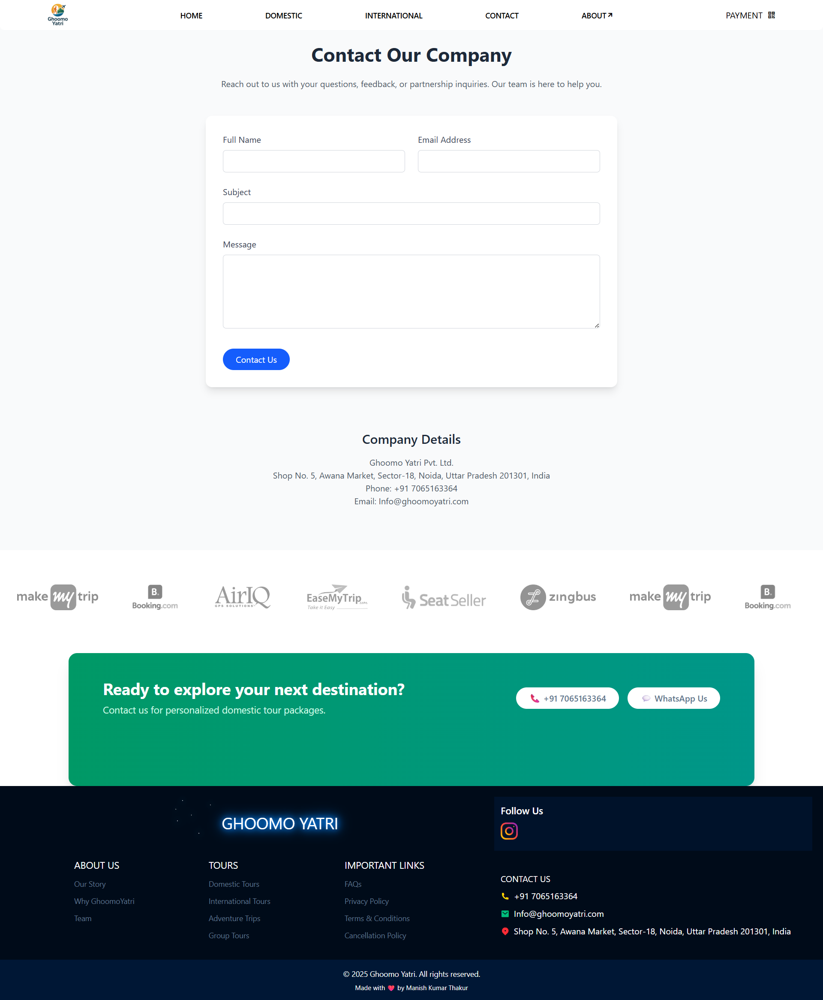
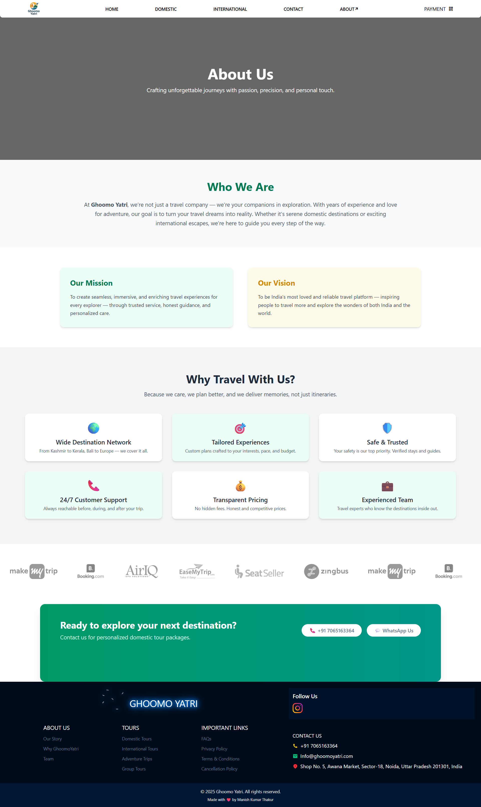
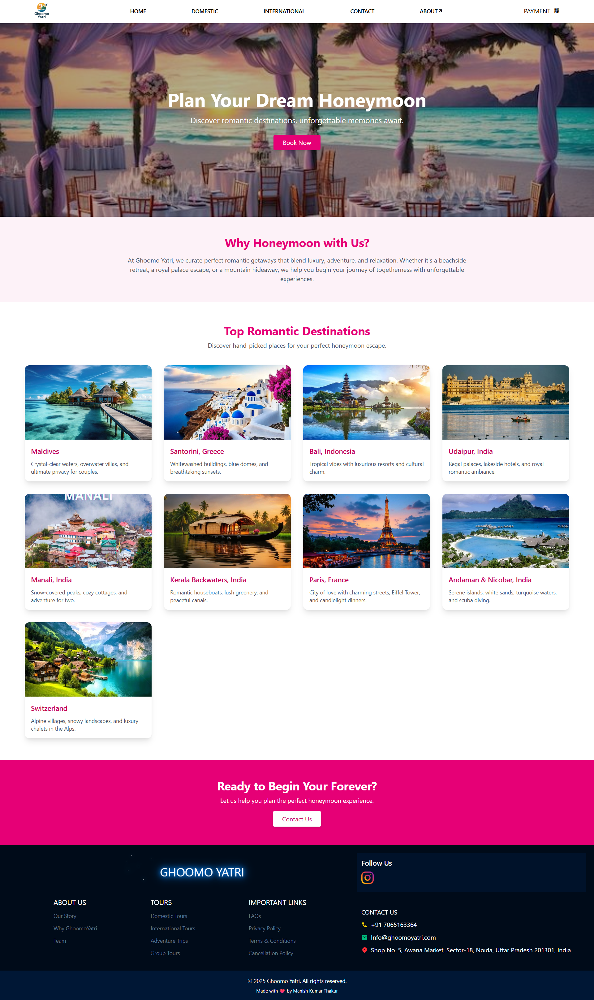
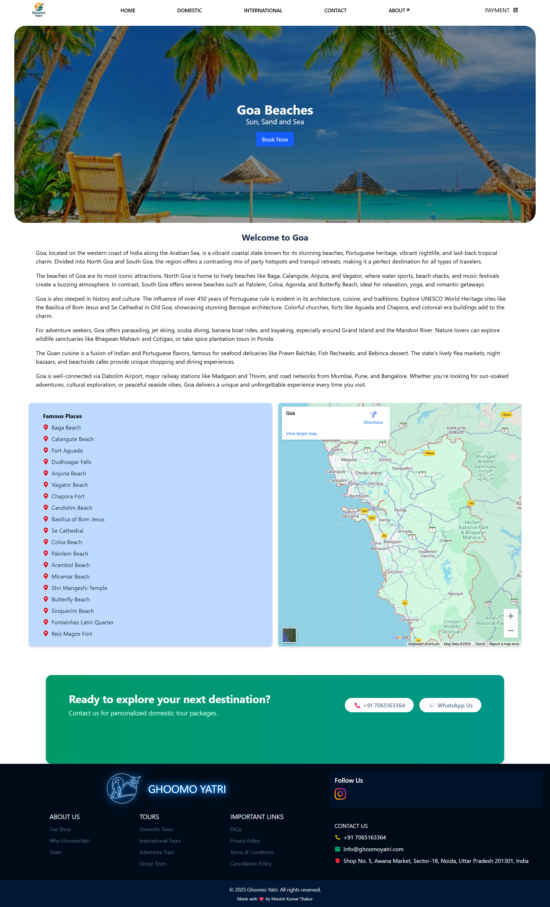

# 🌍 Ghoomo Yatri — Travel & Tour Website


Ghoomo Yatri is a modern, responsive travel and tourism web application that allows users to explore, book, and inquire about domestic and international tour packages. It provides a seamless frontend and backend experience using **React**, **Tailwind CSS**, and **Node.js/Express**, deployed on **Render** and monitored using **UptimeRobot**.

---
## 🎥 Logo animation


## 📁 Project Structure

```
GhoomoYatri/
│
├── client/                       # React frontend (Vite + Tailwind)
│   ├── public/                   # Public assets (for static images like screenshots)
│   └── src/                      # React source files
│       ├── assets/              # Static files (images, icons, fonts, etc.)
│       ├── components/          # Reusable React components
│       ├── data/                # Data files (JSON, JS content)
│       ├── pages/               # Page-based components (routes)
│       ├── App.jsx             # Root component
│       ├── App.css             # Global styles
│       ├── index.css           # Tailwind base & utilities
│       └── main.jsx            # React DOM entry
│
│   ├── index.html               # Vite entry HTML
│   ├── vite.config.js           # Vite configuration
│   ├── vercel.json              # Vercel deployment config
│   ├── package.json             # Frontend dependencies
│   └── package-lock.json
│
├── server/                      # Express backend
│   ├── routes/                  # Route definitions (e.g., /api/contact)
│   ├── controllers/             # Logic for each route
│   ├── .env                     # Environment variables (not committed)
│   └── server.js                # Express entry point
│
├── README.md                    # Project documentation
└── .gitignore                   # Files to ignore in git

```

---

## 🚀 Live Demo

- 🔗 **Frontend**: [ghoomoyatri.vercel.app](https://ghoomo-yatri.vercel.app/)
- 🔗 **Backend API**: [ghoomoyatri-backend.onrender.com](https://ghoomoyatri-backend.onrender.com)

---

## ✨ Features

- 🏞️ Home, About, and Contact Pages
- 📦 Various Tour Categories: Domestic, International, Group Tours, Adventure, Honeymoon, etc.
- 📩 Contact Form (connected to backend)
- 💬 Email integration for tour inquiries
- 💡 Animations using AOS
- 🌐 Fully responsive across devices
- 🖼️ Optimized image loading
- 📊 Backend kept awake with UptimeRobot

---

## 🔧 Tech Stack

### 🌐 Frontend
- **React.js** (Vite)
- **Tailwind CSS**
- **React Router**
- **AOS (Animate On Scroll)**
- **GSAP (Animate Elements)**
- **React Icons**
- **Remix Icons**


### 🖥️ Backend
- **Node.js**
- **Express.js**
- **Nodemailer** (for contact form)
- **CORS**, **dotenv**, **set-cookie-parser**

### 🧩 Deployment
- **Frontend**: [Vercel](https://vercel.com)
- **Backend**: [Render](https://render.com)
- **Uptime Monitoring**: [UptimeRobot](https://uptimerobot.com)

---

## 📥 Installation & Setup

### 🔹 Prerequisites

- Node.js & npm installed

### 🔹 Clone the Repo

```bash
git clone https://github.com/Manish511T/GhoomoYatri.git
cd GhoomoYatri
```

### 🔹 Setup Frontend

```bash
cd client
npm install
npm run dev
```

### 🔹 Setup Backend

```bash
cd server
npm install
node server.js
```

---

## 🔐 Environment Variables

Create a `.env` file inside `server/` folder:

```env
PORT=5000
EMAIL_USER=your-email@example.com
EMAIL_PASS=your-email-password
```

(For Gmail, use App Passwords or OAuth-based secure credentials.)

---

## 🛠️ Backend API Routes

| Method | Route                  | Description              |
|--------|------------------------|--------------------------|
| POST   | `/api/contact`         | Submit contact form      |
| GET    | `/`                    | Health check             |

---

## 📸 Screenshots

<div align="center">

<table>
  <tr>
    <td align="center">
      <strong>Home Page</strong><br>
      <a href="./public/Home.png" target="_blank">
        
      </a>
    </td>
    <td align="center">
      <strong>Domestic Tour Page</strong><br>
      <a href="./public/Domestic.png" target="_blank">
        
      </a>
    </td>
  </tr>
  <tr>
    <td align="center">
      <strong>International Tour Page</strong><br>
      <a href="./public/International.png" target="_blank">
        
      </a>
    </td>
    <td align="center">
      <strong>Contact Page</strong><br>
      <a href="./public/Contact.png" target="_blank">
        
      </a>
    </td>
  </tr>
  <tr>
  <td align="center">
      <strong>About us Page</strong><br>
      <a href="./public/About_us.png" target="_blank">
        
      </a>
    </td>
    <td align="center">
      <strong>Tour Category Page</strong><br>
      <a href="./public/Tour_category.png" target="_blank">
        
      </a>
    </td>
  </tr>
    <tr>
  <td align="center">
      <strong>Tour Places Page</strong><br>
      <a href="./public/Tour_places.png" target="_blank">
        
      </a>
    </td>
  </tr>
</table>

</div>


## 🧠 Future Improvements

- Admin dashboard for managing tours
- Booking & payment gateway integration
- Tour rating and reviews
- User authentication & dashboard

---

## 📩 Contact

> Created by **Manish Kumar**  
> 📧 Email: mkthakur2301@gmail.com  
> 💼 Portfolio: [Soon](#)  
> 💬 Feel free to reach out for collaboration or suggestions!